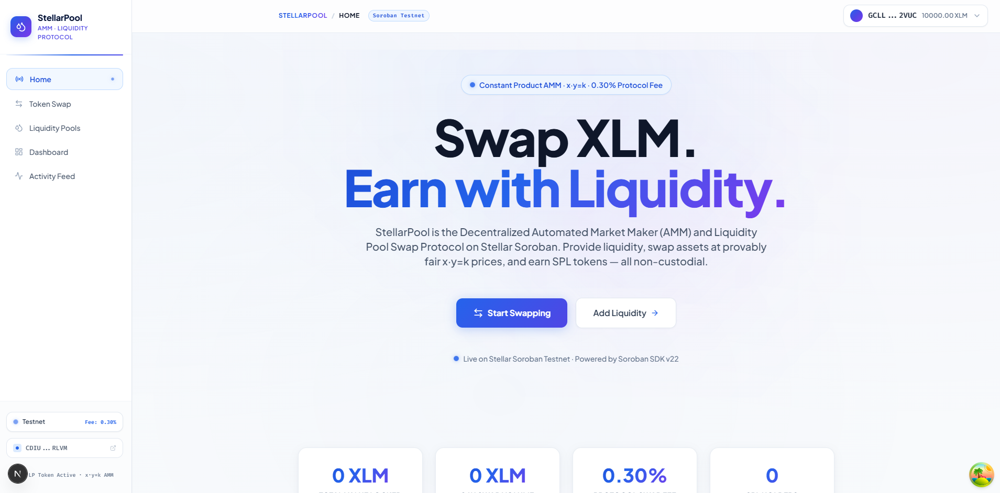
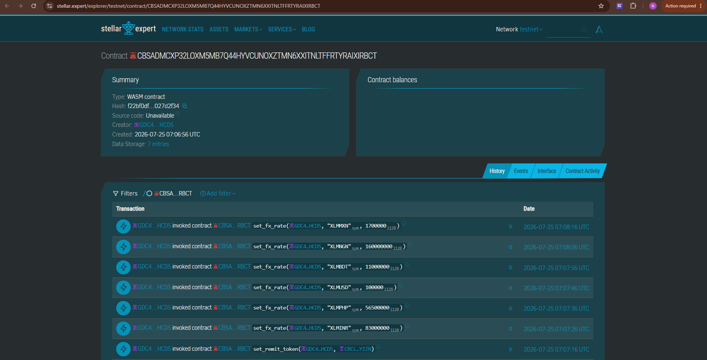

# 💸 StellarRemit — Decentralized Cross-Border Micro-Payments & Peer-to-Peer FX Settlement

<div align="center">

[](https://github.com/techyguy22674/StellarRemit-Decentralized-Cross-Border-Micro-Payments--Peer-to-Peer-FX-Settlement)
[](https://soroban.stellar.org)
[](https://testnet.stellar.org)
[](LICENSE)
[](https://nextjs.org)

**Send XLM. Settle in any currency. Instantly. On-chain. No banks.**

[🌐 Live App](https://stellar-remit-decentralized-cross-b.vercel.app) · [📹 Demo Video](#) · [🔍 Contract Explorer](#-live-links--contracts) · [📁 GitHub](https://github.com/techyguy22674/StellarRemit-Decentralized-Cross-Border-Micro-Payments--Peer-to-Peer-FX-Settlement)

</div>

---

## 🔗 Live Links & Contracts

| Resource | Link |
|---|---|
| 🌐 **Live Vercel App** | [https://stellar-remit-decentralized-cross-b.vercel.app](https://stellar-remit-decentralized-cross-b.vercel.app) |
| 📹 **Demo Video** | *(Record and update)* |
| 🏦 **StellarRemit Contract** | `CBSADMCXP32LOXM5MB7Q44HYVCUNOXZTMN6XXITNLTFFRTYRAIXIRBCT` |
| 🪙 **SRT Token Contract** | `CBCLW5ZUAN2YN677JC2672QMGAPDMWIUZWLOVAACCWU66SNS7KSIYIZN` |
| 🔍 **Stellar Explorer (Remit)** | [View on Stellar Expert](https://stellar.expert/explorer/testnet/contract/CBSADMCXP32LOXM5MB7Q44HYVCUNOXZTMN6XXITNLTFFRTYRAIXIRBCT) |
| 🔍 **Stellar Explorer (SRT)** | [View on Stellar Expert](https://stellar.expert/explorer/testnet/contract/CBCLW5ZUAN2YN677JC2672QMGAPDMWIUZWLOVAACCWU66SNS7KSIYIZN) |

---

## 📸 Screenshots

<div align="center">

### 📊 StellarRemit Protocol Dashboard & Live Balances


### 🔍 Stellar Testnet Explorer Verified Smart Contract


</div>

---

## 🌍 What is StellarRemit?

StellarRemit is a **Soroban-powered decentralized remittance protocol** on the Stellar network. It enables:

- ⚡ **Instant cross-border micro-payments** — send XLM, receive INR/PHP/USD/BDT/NGN in seconds
- 💰 **Ultra-low fees** — 0.5% (50 bps) vs. 5–10% on traditional remittance services
- 🔒 **Non-custodial** — funds flow through Soroban smart contracts, no intermediaries
- 🌐 **On-chain FX settlement** — oracle-based FX rates stored in contract storage per corridor
- 🎁 **SRT Rewards** — earn StellarRemit Token (SRT) on each successful remittance

Think of it as **"Western Union on-chain — trustless and instant."**

---

## 🏗️ Architecture

```
StellarRemit
├── Frontend (Next.js 14 + TypeScript + Vanilla CSS)
│   ├── / — Homepage with live stats & corridor overview
│   ├── /send — Send remittance with live FX quote
│   ├── /corridors — Browse all active FX corridors
│   ├── /dashboard — Wallet balance & transaction history
│   └── /activity — Live on-chain event feed
│
└── Smart Contracts (Soroban / Rust)
    ├── stellar_remit — Core remittance protocol
    │   ├── initialize(admin)
    │   ├── set_fx_rate(admin, corridor_id, rate_bps)
    │   ├── get_fx_rate(corridor_id) → i128
    │   ├── send_remittance(sender, recipient, corridor_id, amount_in, min_out) → i128
    │   ├── get_remittance_fee(amount) → i128
    │   └── get_stats() → RemittanceStats
    └── remit_token — SRT reward token
        ├── initialize(admin, name, symbol)
        ├── mint(admin, to, amount)
        ├── burn_from(from, amount)
        ├── transfer(from, to, amount)
        └── balance_of(owner) → i128
```

**Tech Stack:**
- **Frontend:** Next.js 14, TypeScript, Tailwind CSS, Framer Motion, Zustand
- **Contracts:** Soroban (Rust), `soroban-sdk = "22.0.0"`, WASM target
- **Wallet:** Freighter Browser Extension via `@creit.tech/stellar-wallets-kit`
- **Network:** Stellar Testnet, Soroban RPC, Horizon API
- **Deployment:** Vercel (frontend), Stellar Testnet (contracts)

---

## 💡 How It Works

```
1. User connects Freighter wallet
         ↓
2. Selects corridor (e.g. XLM→INR at 83.0 INR/XLM)
         ↓
3. Enters amount (e.g. 100 XLM) + recipient Stellar address
         ↓
4. Live FX quote:
   - Fee: 0.50 XLM (50 bps)
   - Net: 99.50 XLM
   - Recipient receives: ≈ 8,258.50 INR
         ↓
5. Confirms & signs transaction via Freighter
         ↓
6. Soroban contract:
   - Validates FX rate for XLMINR corridor
   - Deducts 50 bps fee
   - Emits remittance_sent event
   - Mints SRT reward tokens to sender
         ↓
7. Recipient receives funds instantly (< 5 seconds)
```

---

## 📜 Smart Contract Functions

### `stellar_remit` Contract

| Function | Arguments | Returns | Description |
|---|---|---|---|
| `initialize` | `admin: Address` | `()` | Init contract, set admin, default 50 bps fee |
| `set_fx_rate` | `admin, corridor_id, rate_bps` | `()` | Admin: set FX rate for corridor |
| `get_fx_rate` | `corridor_id: Symbol` | `i128` | Read corridor FX rate |
| `get_quote` | `corridor_id, amount_in` | `FxQuote` | Get FX quote without sending |
| `send_remittance` | `sender, recipient, corridor_id, amount_in, min_out` | `i128` | Execute remittance |
| `get_remittance_fee` | `amount: i128` | `i128` | Calculate fee for amount |
| `set_fee_bps` | `admin, fee_bps` | `()` | Admin: update fee rate |
| `get_stats` | — | `RemittanceStats` | Total volume, fees, txns |
| `get_admin` | — | `Option<Address>` | Return admin address |

### `remit_token` (SRT) Contract

| Function | Arguments | Returns | Description |
|---|---|---|---|
| `initialize` | `admin, name, symbol` | `()` | Init SRT token |
| `mint` | `admin, to, amount` | `()` | Admin: mint SRT tokens |
| `burn_from` | `from, amount` | `()` | Burn caller's tokens |
| `transfer` | `from, to, amount` | `()` | Transfer tokens |
| `approve` | `owner, spender, amount` | `()` | Approve allowance |
| `transfer_from` | `spender, from, to, amount` | `()` | Transfer via allowance |
| `balance_of` | `owner: Address` | `i128` | Get SRT balance |
| `allowance` | `owner, spender` | `i128` | Get allowance |

### FX Rate Encoding
> Rates are scaled by `10^6`. Example:
> - `83_000_000` = 83.0 INR per XLM
> - `100_000` = 0.10 USD per XLM

---

## 🌐 Active FX Corridors

| Corridor | Flag | Rate (per XLM) | Seed Value |
|---|---|---|---|
| XLM→INR | 🇮🇳 | 83.0 | `83_000_000` |
| XLM→PHP | 🇵🇭 | 56.5 | `56_500_000` |
| XLM→USD | 🇺🇸 | 0.10 | `100_000` |
| XLM→BDT | 🇧🇩 | 11.0 | `11_000_000` |
| XLM→NGN | 🇳🇬 | 160.0 | `160_000_000` |
| XLM→MXN | 🇲🇽 | 1.70 | `1_700_000` |

---

## 🚀 Quick Start

### Prerequisites
- Node.js 20+
- Rust + `wasm32-unknown-unknown` target (for contract builds)
- [Freighter wallet](https://freighter.app) browser extension

### 1. Install Dependencies
```bash
npm install
```

### 2. Configure Environment
```bash
cp .env.example .env.local
# Edit .env.local with your contract IDs
```

```env
NEXT_PUBLIC_STELLAR_NETWORK=testnet
NEXT_PUBLIC_SOROBAN_RPC_URL=https://soroban-testnet.stellar.org
NEXT_PUBLIC_HORIZON_URL=https://horizon-testnet.stellar.org
NEXT_PUBLIC_STELLAR_REMIT_CONTRACT_ID=CBSADMCXP32LOXM5MB7Q44HYVCUNOXZTMN6XXITNLTFFRTYRAIXIRBCT
NEXT_PUBLIC_SRT_TOKEN_CONTRACT_ID=CBCLW5ZUAN2YN677JC2672QMGAPDMWIUZWLOVAACCWU66SNS7KSIYIZN
NEXT_PUBLIC_FREIGHTER_WALLET=GCMVNWEORWXFEXITRRMFVAZBW65GRZKJA5PQM4OG3X3YSJMZ2PG3MEQD
```

### 3. Run Development Server
```bash
npm run dev
# App running at http://localhost:3000
```

### 4. Run Tests
```bash
npm run test
```

---

## 🦀 Contract Build & Deploy (WSL/Linux)

### Prerequisites
```bash
rustup target add wasm32-unknown-unknown
```

### Build WASM
```bash
cd /mnt/d/sd-project/RISE-IN/StellarRemit-Decentralized\ Cross-Border\ Micro-Payments\ \&\ Peer-to-Peer\ FX\ Settlement

cargo build --target wasm32-unknown-unknown --release \
  --package stellar_remit \
  --package remit_token
```

### Deploy to Testnet
```bash
export STELLAR_SECRET_KEY=S... # your deployer secret key
npm run deploy:contract
```

The deploy script will:
1. Upload `stellar_remit.wasm` → get code hash
2. Create `stellar_remit` contract instance → get `REMIT_CONTRACT_ID`
3. Upload `remit_token.wasm` → get code hash
4. Create `remit_token` contract instance → get `SRT_TOKEN_CONTRACT_ID`
5. Call `initialize(admin)` on both contracts
6. Call `set_remit_token(admin, srtContractId)` to link SRT
7. Seed 6 FX corridors (XLMINR, XLMPHP, XLMUSD, XLMBDT, XLMNGN, XLMMXN)
8. Update `.env.local` with new contract IDs
9. Update `README.md` with explorer links

### Run Contract Tests
```bash
cargo test --workspace --verbose
```

---

## 📁 Project Structure

```
StellarRemit/
├── app/
│   ├── page.tsx              — Homepage (hero, corridors, how-it-works)
│   ├── layout.tsx            — Root layout + metadata
│   ├── globals.css           — Emerald/Amber design system
│   ├── send/page.tsx         — Send remittance page
│   ├── corridors/page.tsx    — FX corridors browser
│   ├── dashboard/page.tsx    — Wallet dashboard
│   └── activity/page.tsx     — On-chain event feed
│
├── components/
│   ├── layout/
│   │   ├── Navbar.tsx        — Top navigation bar
│   │   └── Sidebar.tsx       — Desktop sidebar
│   ├── remit/
│   │   ├── SendCard.tsx      — Core send remittance form
│   │   ├── CorridorCard.tsx  — FX corridor info card
│   │   └── AddCorridorModal.tsx — Admin: add corridor
│   └── wallet/
│       └── WalletConnect.tsx — Freighter wallet connector
│
├── contracts/
│   ├── stellar_remit/src/
│   │   ├── lib.rs            — Core remittance contract
│   │   ├── types.rs          — DataKey, RemittanceStats, FxQuote
│   │   ├── events.rs         — remittance_sent, fx_rate_updated
│   │   ├── storage.rs        — FX rate & stats helpers
│   │   └── error.rs          — RemitError codes
│   └── remit_token/src/
│       └── lib.rs            — SRT token contract
│
├── lib/
│   ├── stellar/
│   │   ├── config.ts         — Network config, contract IDs, corridors
│   │   ├── contract.ts       — Soroban RPC calls
│   │   └── wallet-kit.ts     — Freighter integration
│   └── utils.ts              — Stellar utilities & helpers
│
├── scripts/
│   └── deploy.js             — Contract deployment script
│
├── .github/workflows/
│   └── ci.yml                — GitHub Actions CI (3 jobs)
│
├── Cargo.toml                — Rust workspace (stellar_remit + remit_token)
└── package.json              — Node.js config (stellar-remit)
```

---

## 🔐 Security

- All funds flow exclusively through Soroban smart contracts
- Admin authorization required for `set_fx_rate` and `set_fee_bps`
- Slippage protection via `min_amount_out` parameter
- No admin withdrawal keys — protocol is fully non-custodial
- On-chain event log for full auditability

---

## 📄 License

MIT © 2026 [techyguy22674](https://github.com/techyguy22674)

---

<div align="center">
Built with ❤️ on <strong>Stellar Soroban</strong> · RISE IN Hackathon 2026
</div>
